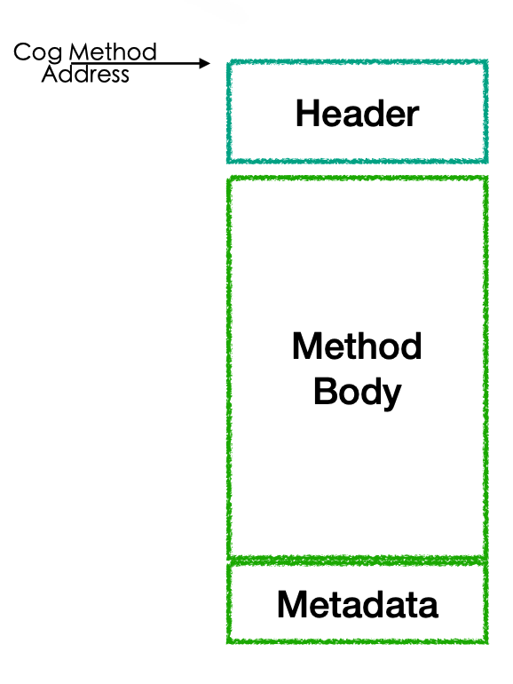
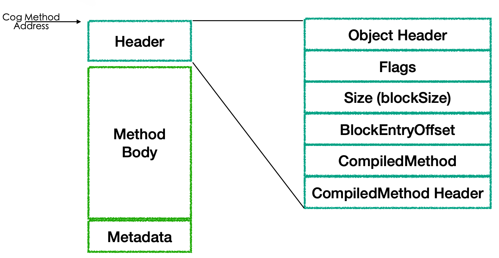

## Code Layout

The input is here.

[https://rmod-files.lille.inria.fr/Team/Presentations/VMPresentations/2020-StructureOfMachineCodeMethods.pdf](https://rmod-files.lille.inria.fr/Team/Presentations/VMPresentations/2020-StructureOfMachineCodeMethods.pdf)

### Code Layout Overview

A jitted method is structured in three parts as shown in Figure *@methodStructure1@*: 

- a meta data / header
- a method body
- a meta data about the compiled code



### Meta-Data Header
This header is common to Cog method, a PIC, and a megamorphic call site.

An object header at the address of a jitted method describes the meta information about the method. 
The method header consists of (see Figure *@methodStructureHeaderWithZoom@*:

- A header. 
It makes jitted method objects similar to normal objects, marked as reachable so as to survive garbage collection until it is not needed to free up space, which is much needed since jitted methods are stored in a 1,4 mb memory region.
- flags. For example to describe if we should create a frame or not (tobe investigated)
- block size is the size in bytes of the entire method, including the header.
- block entry offset is the offset from the header address to the start of the method.
- A pointer to the compiled method it is compiled from. Note that the compiled method has also a pointer to its jit method. 
- The compiled method’s header. It is stored in the jitted method with the following attributes:
  - Flags about the type of encoder used.
  - if it has a primitive number of arguments passed to the method.
  -  number of temp variables.
  -  number of literals.
  -  frame size.





### Preamble and Postamble

The Method body has the following separated and tagged structure:
-  the abort routine code, executed if send messages fails or the stack limit is reached. 
-  Checked entry point that verifies the receiver is of the expected class, otherwise called type Guard. If there’s a mismatch between the types, The method is aborted.
- Unchecked entry point that skips the receiver class check.
- In presence of primitives, their code is next.
- If the method is framefull, the Frame-Building code is inserted.
- The frameless method has no creation of a frame code because its execution isn’t interrupted by a message call.
- The frame full however has to manage the call stack with stack frames storing arguments, receiver and interruption points’ program counter to deal with eventual message sends in their execution context.
- The method code is last.

At the end of the cog method is the method map, which has meta data identifying interesting points in the machine code. The map is read backwards starting from the blockSize offset of the CogMethod. It has object references sends and pc-mapping points in the machine code, which helps garbage collector find and update object references, method cache flushing, convert between byte-code and machine code pcs by looking for matching points in the map.

### Method Entry Points

The each portion of code is tagged to give direct access to it. For example:

- The abort routine can be branched-to when method code fails.
- You can skip access to the type checking by jumping to the start of the next code block. 

### CogMethod in Pharo and C 
  
Here is the class `CogMethod` in Pharo that represents the jitted method as shown in Listing *@jitmethodstruc@*.
This is this class that once generated in C as structure represents jitted methods. 

```
VMStructType << #CogMethod
	slots: {
			 #objectHeader .
			 #homeOffset .
			 #startpc .
			 #padToWord .
			 #cmNumArgs .
			 #cmType .
			 #cmRefersToYoung .
			 #cpicHasMNUCaseOrCMIsFullBlock .
			 #cmUsageCount .
			 #cmUsesPenultimateLit .
			 #cbUsesInstVars .
			 #cmUnusedFlags .
			 #stackCheckOffset .
			 #blockSize .
			 #picUsage .
			 #methodObject .
			 #methodHeader .
			 #selector };
	sharedPools: { CogMethodConstants . VMBasicConstants . VMBytecodeConstants };
	tag: 'JIT';
	package: 'VMMaker'
```

Once the code is generated we obtain the following C structure in the file CogMethod.h.


```language=C&anchor=jitmethodstruc
typedef struct {
	sqLong	objectHeader;
	unsigned		cmNumArgs : 8;
	unsigned		cmType : 3;
	unsigned		cmRefersToYoung : 1;
	unsigned		cpicHasMNUCaseOrCMIsFullBlock : 1;
	unsigned		cmUsageCount : 3;
	unsigned		cmUsesPenultimateLit : 1;
	unsigned		cbUsesInstVars : 1;
	unsigned		cmUnusedFlags : 2;
	unsigned		stackCheckOffset : 12;
	unsigned short	blockSize;
	unsigned short	picUsage;
	sqInt	methodObject;
	sqInt	methodHeader;
	sqInt	selector;
 } CogMethod;
```

### Word about cmUsageCount

Since the code zone is not infinite, it needs to be compacted from time to time. 
The field `cmUsageCount` uses 3 bits to represent the number of use the jitted method that is used by walking the stack. This field is used to decide which jitted methods can be removed from the code zone.  


### Primitive Method Layout

Primitives have fiew variations from the normal methods, they have a C implementation or native machine code, based on these implementations  we have three types of primitives:

- A function written in C, also called plugin .
- A function written completely in machine code, called Complete primitives.
- First part of the method body has machine code for fast paths, if the primitive fails executing, in other words the case calling the primitive doesn't corrrespond to a fast path, it continue through the methed to delegate to a c function.
    
When The primitive code succeeds it returns result before having to create a new frame for the fallback code.

Complete, Unfailing and Unimplemented primitives


