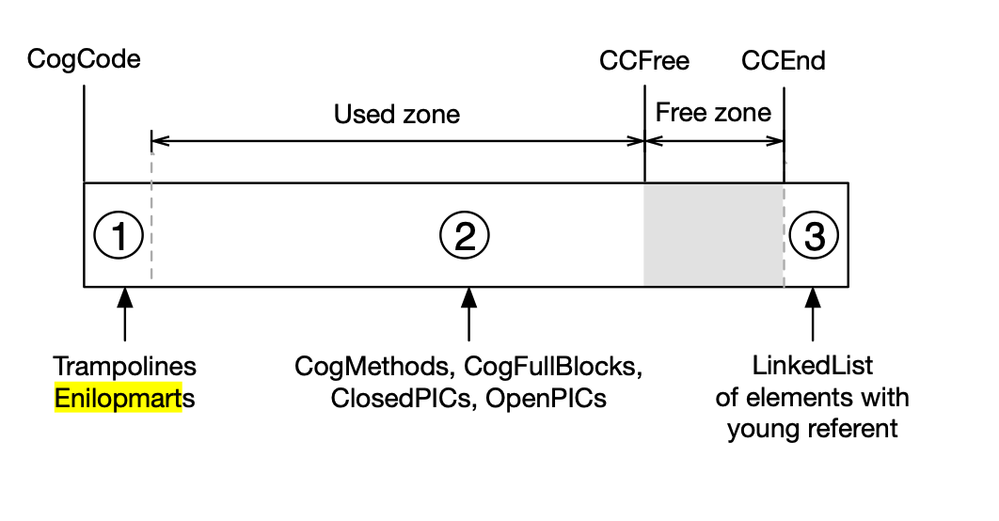

The input is: [https://rmod-files.lille.inria.fr/Team/Presentations/VMPresentations/VM-Runtime.pdf](https://rmod-files.lille.inria.fr/Team/Presentations/VMPresentations/VM-Runtime.pdf)

[https://rmod-files.lille.inria.fr/Team/Texts/Papers/Kale17a-IWST-VMProfiler.pdf](https://rmod-files.lille.inria.fr/Team/Texts/Papers/Kale17a-IWST-VMProfiler.pdf)
## Runtime Interactions

### The Two Stacks

### Trampolines and enilopmarts
Trampolines facilitate method invocation and transitioning between execution contexts, they are used as jumps from generated native code to c code.

Reverse trampolines are the jumps to (cog methods/ non-compiled Methods / c runtimecode), while running c runtime code, if it is not possible to stay in the native code it will get back to the native code. For example if there is no space left, the garbage collector is solicited via trampoline.

Trampolines are used in slow execution paths that require the vm to prepare for method execution. For example if the method to be called is not cached and needs to be looked up dynamically, the VM will take longer to invoke the method.
Other use cases are :
	- send a message to non-jitted methods, since they don’t have optimised code and have to be executed with the byte-code interpreter, The interpreter tries to keep this execution mode for as long as possible.
	- PIC, polymorphic inline caching .
	- Calling the garbage collector, for example if new message doesn’t find space left, the GC is called via a trampoline to the c runtime code, because it is not a compiled.
	- Slow allocations.
	- Immutability checks, which are guards to check that targeted objects by the message is not being modified elsewhere .
    _ Discovery routine at vm start-up. to know which instructions the processor supports.

Reverse trampolines are used to call jitted methods, and low level routines like getting the state of the machine.

### Calling Convention

The c functions are compiled by c compiler, and we don’t know which registers they use, We have to be careful using them since they could do anything. The generated native code runs in a separate stack and doesn’t follow the C calling convention. 

	

#### Calling Interpreter from Interpreter

Natural

#### Calling MC from MC

Natural

#### Calling MC from Interpreter

Two ways to jump, by return, by call.
To make the transition the native code calls a trampoline that prepares arguments and aligns the stack, sets up conditions to then call the c code if those are satisfied.

#### Calling Interpreter from MC

Reentering the interpreter, sigjmp, setjump.

VM C runtime calls a reverse trampoline (enilopmart) that prepares arguments and switches to smalltalk stack and returns to the generated method to avoid having reverse trampoline in the stack.

Reverse trampolines take arguments through the smalltalk stack, pop them and puts them in the right spots (e.g., registers) then returns to the generated method.

### Exiting MC Slow paths

must be boolean, store checks, write barriers...

### The Native code zone

This memory zone has jitted methods and intrinsics generated at the vm startup like trampolines and associating machine code frame to a context object.
 The figure *@trampolinesInNativeCodeZone@* shows three areas of the native code zone:
    1. The first one includes native code routines trampolines and enilopmarts. 
    2. Native functions, otherwise called CogMethods if a method is compiled, CogFullBlocks for block closures, PICs.
    3. A linked-list of native functions and PICs referencing young objects.

When the space is full the compaction is done based on the least recently used naive algorithm to free a quarter of the machine code zone.